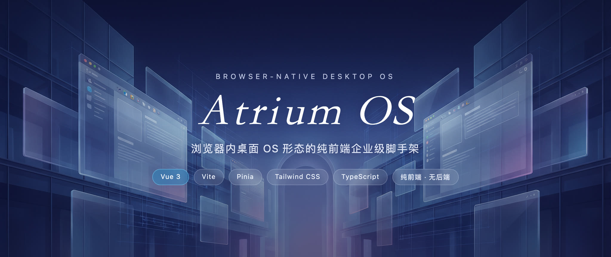
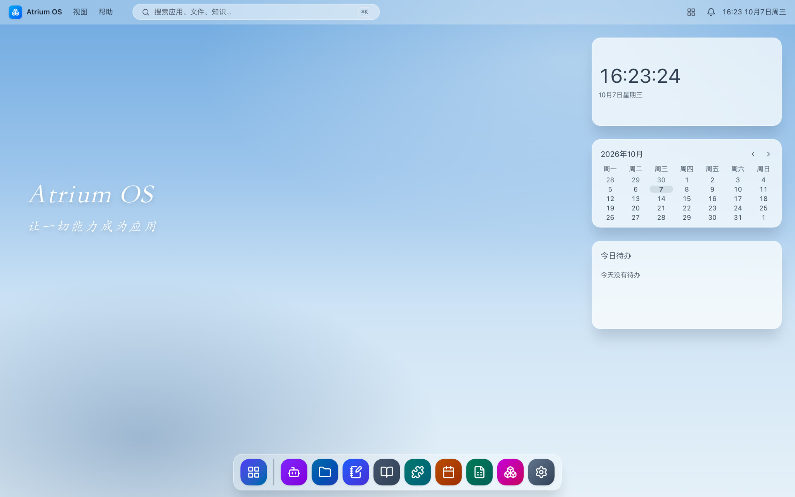
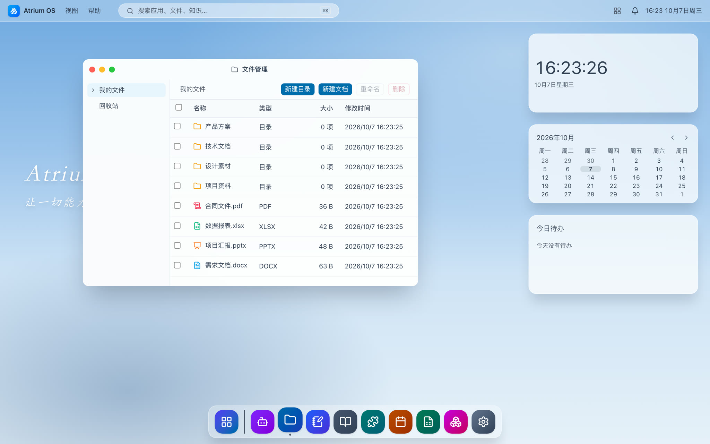
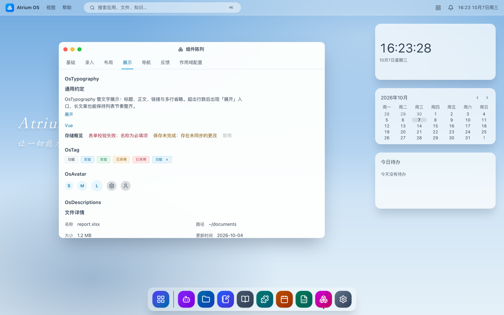
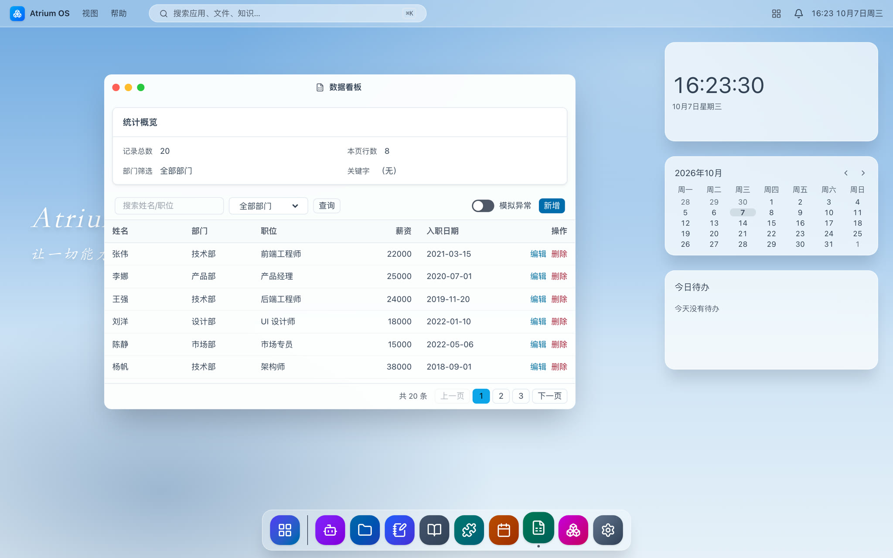
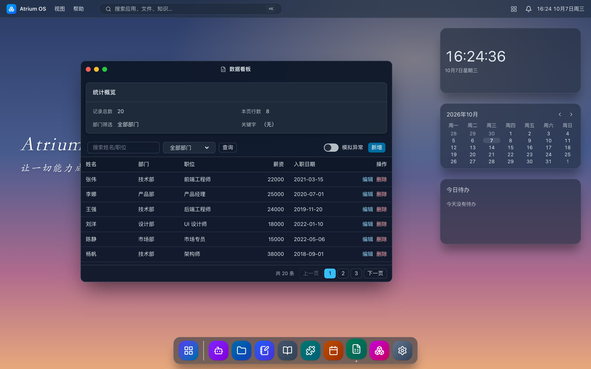

<p align="center">
  
</p>

# Atrium OS

**English** | [简体中文](README.md)

[](https://github.com/lq200lq/atrium-os/actions/workflows/ci.yml)
[](LICENSE)

**A pure-frontend enterprise-grade scaffold shaped like a desktop OS in the browser.** Vue 3 + Vite + Pinia + Tailwind CSS — growing an enterprise frontend foundation (app integration contract, permissions, component library, theme tokens, i18n, data access, desktop widgets) into the form of a desktop operating system.

Pure frontend project: no backend and no mock server. The data boundary is the kernel-layer VFS store with IndexedDB persistence — "wiring real data" means real CRUD against the store, not connecting to a service.

## Features

- **App integration contract**: `npm run gen:app` scaffolds an app that ships with permissions, i18n, windows, and drill-down capabilities
- **41-component library**: a unified `src/ui` contract (Os prefix), browsable and interactive in the component gallery app
- **Theme & tokens**: semantic design tokens with light/dark themes; bare color values and bare spacing are blocked by gates
- **i18n**: zh-CN / en-US locale packs, with test guards for key-set alignment and a gate against hardcoded Chinese in UI templates
- **Desktop widgets**: right-anchored streaming grid, drag & discrete gear switching, a `gen:widget` generator, and contract gates
- **Quality line**: strict TypeScript, ESLint, Prettier, unit tests + Playwright e2e, axe accessibility scans, component-level visual baselines, bundle size budget

## Screenshots

All of the following are real screenshots of the running app (`npm run dev`, 1440×900 viewport @2x) — not design mockups.

<p align="center">
  
</p>

<table>
  <tr>
    <td align="center" width="50%">
      <br />
      <sub>File manager: VFS directory tree + file table</sub>
    </td>
    <td align="center" width="50%">
      <br />
      <sub>Component gallery: 41 Os components, browsable interactively</sub>
    </td>
  </tr>
  <tr>
    <td align="center">
      <br />
      <sub>Data board: unified contract for filter / pagination / sort</sub>
    </td>
    <td align="center">
      <br />
      <sub>Dark theme: semantic tokens, one-click switch</sub>
    </td>
  </tr>
</table>

## Quick start

Requires **Node.js 24+** (the repo ships an `.nvmrc`; just run `nvm use`).

```bash
npm ci
npm run dev        # app dev server
npm run docs:dev   # docs site (website/)
```

## Quality gates

One command reproduces the CI `check` job:

```bash
npm run verify
```

| Command                      | Purpose                                                                                                 |
| ---------------------------- | ------------------------------------------------------------------------------------------------------- |
| `npm run verify`             | type-check, lint, format, the token/widget/i18n gates, coverage, build + bundle budget, docs site build |
| `npm run verify:e2e`         | Playwright e2e (excluding the a11y / visual specialists)                                                |
| `npm run test:e2e:a11y`      | axe accessibility scans + keyboard contract                                                             |
| `npx playwright test visual` | Component-level visual baselines (darwin, per-platform directories)                                     |
| `npm run check:tokens`       | Audit for bare color values / bare spacing / bare elevation                                             |
| `npm run check:i18n`         | Audit for hardcoded Chinese in UI templates                                                             |
| `npm run check:widgets`      | Widget contract gates (T5/T9/T12/T15)                                                                   |

## Repository layout

```
src/
  apps/        apps (file-manager, data-board, settings, widget-center …)
  shell/       desktop shell (top bar, Dock, windows, widget layer, Spotlight)
  ui/          Os component library (41 components, one contract)
  components/  business components shared by shell and apps
  widgets/     desktop widgets (10 built-ins, one directory each)
  kernel/      kernel capabilities (VFS store, IndexedDB, data access, bus, widget runtime)
  i18n/        zh-CN / en-US locale packs
  styles/      design tokens and themes
  windows/     window-embedded views
website/       VitePress docs site
scripts/       quality gates and generators (check-*, gen-*)
tests/unit/    Vitest unit tests (including fixtures that self-prove the gate scripts)
tests/e2e/     Playwright e2e (a11y / keyboard / visual / widget acceptance)
```

## Documentation

Docs site: `npm run docs:dev` (component API tables are generated from source by `npm run docs:gen`, and `docs:check` guards against drift). For an architecture and conventions overview, see [`website/architecture.md`](website/architecture.md).

## Contributing

Issues and PRs are welcome: see [CONTRIBUTING.md](CONTRIBUTING.md) (commit conventions, gate checklist, scope boundaries), and please follow the [Code of Conduct](CODE_OF_CONDUCT.md). Please do not report security issues publicly — see [SECURITY.md](SECURITY.md).

## License

[Apache License 2.0](LICENSE)
